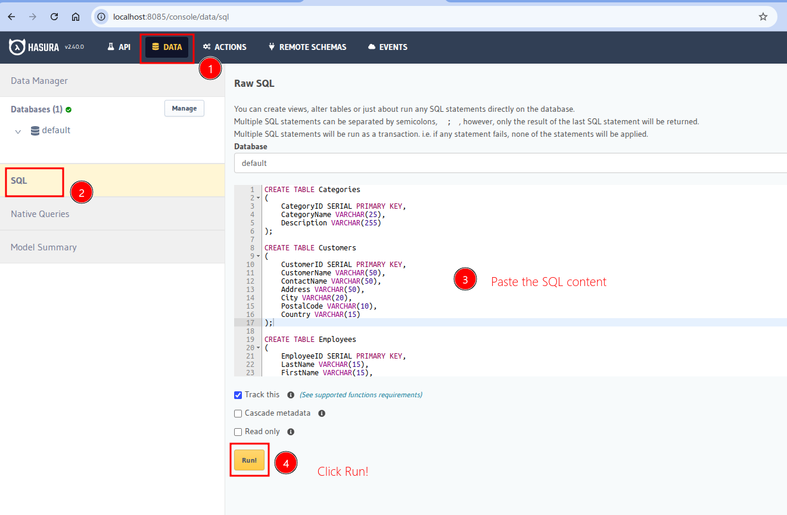
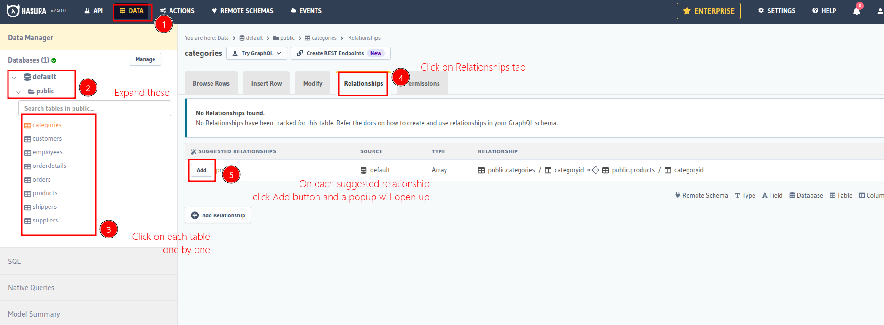

# GQL Sample 

This repo is for a session on GQL

## Setup
Run 
```
docker compose up -d
```
This will run a postgres container and hasura container. Once all containers are up, You should be able to access hasura at `localhost:8085`.    

> [!NOTE]  
> Hasura admin secret is set as `admin123`

### add the data
1. navigate to `localhost:8085`
2. copy the  content from `northwind_data.sql` and paste in the field shown below



3. Then set suggested relations in the Hasura console(for each table)



4. In the popup that opens up. You can change the name of the relationship or keep it the same. click on **Track Relationship**

5. Once relationships are tracked for all tables. Click on **API** on the top menu bar and use the query builder
